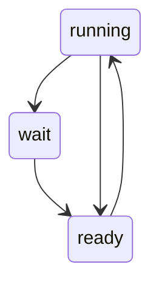
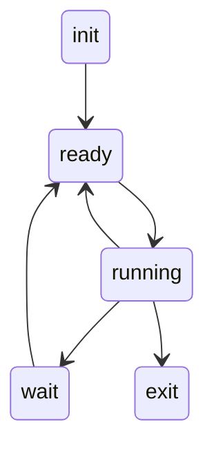

## 进程、线程、协程
进程资源分配的基本单位
（内核态）线程，逻辑上的一个执行流，逻辑cpu，操作系统调度的基本单位
协程一个任务单位

## 进程的特征
- 动态性
- 并发性
- 独立性
- 异步性
- 结构性
## 进程的组成
PCB、 进程地址空间（代码段，数据段）、 从操作系统申请到的资源
### pcb组成
```c
struct task_struct {
/*
进程状态
*/
/*
标识符字段
进程标识符 线程标识符 进程组标识符 会话id
*/
/*
家族亲缘关系
指向进程组领头进程的引用
指向进程组的链表
指向父进程
指向子进程的链表
指向相邻兄弟的引用
指向领头线程的引用
*/
/*
指向内核栈和thread_info的引用
*/
/*
struct thread_struct thread;
保存上下文
*/
/*
cwd
*/
/*
进程调度信息
*/
/*
文件描述符表
struct files_struct *files;
*/
/*
内存描述符
*/
/*
进程标记
反应进程状态的信息，但不是运行状态，用于内核识别进程当前的状态，以备下一步操作
*/
/*
实现调试的字段
*/
/*
信号处理
*/
...
}
```
## 进程和程序区别
- 一对一
- 一对多: 一个进程在周期内多次调用`exec`切换不同程序执行
- 多对一：一个多进程架构的程序如浏览器，每一个窗口对应一个独立的进程
## 状态模型
### 三态模型

## 五态模型

### linux状态模型

## 控制原语
进程控制是使用**原语**来实现的
### 创建
#### 创建原语

1. 申请空白PCB
2. 为进程分配所需资源
3. 初始化PCB
4. 将PCB插入就绪队列（**创建态→就绪态**）
#### 引起进程创建的事件
- 用户登录
- 作业调度（_有新的作业将要运行_）
- 提供服务
- 应用请求（_用户进程主动请求创建子进程_）

### 终止
#### 撤消原语
- 从PCB集合中找到终止进程的PCB
- 若进程正在运行，立刻剥夺CPU，将CPU分配给其他进程
- 中止其所有子进程
- 将该进程所有资源归还给父进程或是操作系统
- 删除PCB
### 引起进程中止的事件
- 正常结束
- 异常结束
- 外界干预
### 进程的阻塞和唤醒
阻塞原语和唤醒原语必须成对使用
#### 阻塞原语
- 找到要阻塞进程对应的PCB
- 保护进程运行现场，将进程设置为阻塞态，暂时停止进程运行
- 将PCB插入对应事件的等待队列
#### 引发阻塞的事件
- 需要等待系统分配某种资源
- 需要等待合作的其他进程完成工作
#### 唤醒原语
- 在事件队列中找到对应的PCB
- 将PCB从等待队列移除，设置为就绪态
- 将PCB插入就绪队列，等待被唤醒
#### 引发唤醒的事件
- 等待的事件发生
### 进程的切换
#### 切换原语
- 将运行环境信息存入PCB
- PCB移入相应队列
- 选择另一个进程执行，并更新其PCB
- 根据PCB回复进程所需的运行环境
- 运行环境：进程运行中的临时变量等
#### 引起切换的事件
当前进程时间片到
更高优先级的进程到达
当前进程主动让出时间片
当前进程中止
## IPC
- 管道
- 消息
- 共享内存
- 信号量
- 信号量
- 套接字
## 调度

### 三级调度层次
- 高级调度 作业调入内存
- 中级调度 把挂起的作业暂时交换到外存
- 低级调度 分配到cpu资源

### 抢占式调度 非抢占式调度
### 指标
- 公平(会不会饥饿)
- CPU利用率 
- 系统吞吐量
- 周转时间 平均周转时间 带权平均周转时间
- 响应时间 平均响应时间 带权平均响应时间
- 响应比
- 调度开销
### （单核）调度策略
- FCFS
- SJF（SRTF）(抢占式)
- 高响应比优先
- RR
- 优先级调度
- 多级队列
- MLFQ 多级反馈队列
- 随机调度
- 彩票调度（步长调度）
#### 比较

|          | 抢占式 | 公平   | 周转  | 响应  | 其他                                                                                             |
| -------- | --- | :--- | :-- | :-- | :--------------------------------------------------------------------------------------------- |
| FCFS     | X   | O    | X   | X   | 简单，对短任务不利,排在长作业后的短作业需要等待很长的时间，带权周转时间很大                                                         |
| SJF（非抢占） | X   | X    | O   |     | 作业调度批处理系统，长作业饥饿                                                                                |
| SRTF     | O   | 同上   | 同上  | 同上  | 同上                                                                                             |
| 高响应比优先   | X   | O    | O   | O   | 优缺点综合考虑了等待时间和运行时间（要求服务时间）等待时间相同时，要求服务时间短的优先要求服务时间相同时，等待时间长的优先对于长作业而言，等待时间越长响应比越高，避免了饥饿问题，计算开销大 |
| RR       | O   | O    |     | O   | 分时系统，上下文切换开销                                                                                   |
| 优先级调度    | 皆可  | 动物庄园 |     |     |                                                                                                |
| 多队列      |     |      |     |     | 队列之间固定优先级：高优先级队列空时低优先级才能被调度时间片划分：各自分配不同百分比的时间片队列内部可以采取不同的调度策略                                  |
| 多级反馈队列   | O   | O    | O   | O   | 对于长作业而言....,对于短作业而言....,对于交互密集型作业（IO密集型）...，对于计算密集型...                                         |
### 多核调度策略
- 单队列多处理机调度 SQMS
- 多队列多处理机调度 MQMS
- 缓存亲和度
- 工作窃取
### linux调度
- o(1)调度
- cfs
- bfs

