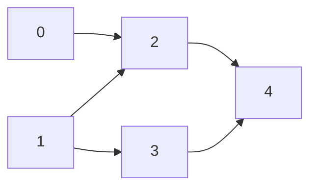

## 概念
临界资源
进入区临界区退出区剩余区
同步互斥

## 互斥量
### 原则
- 空闲让进
- 忙则等待
- 有限等待
- 让权等待
### 指标
**有效**，公平, 开销
### 实现
#### 单标志法
```
class Mutex {
	flag: bool
	Mutex(): flag(false)
	func lock() {
		while flag {}
		flag = true
	}

	func unlock() {
		flag = false
	}
}
```

1. 自旋等待浪费cpu时间
2. 检测是否空闲和上锁的过程不是原子的导致竞争 -> [[同步与互斥#原子指令|使用原子指令]]
#### 原子指令
```
class Mutex {
	flag: AtomicBool
	Mutex(): flag(false)
	func lock() {
		while flag.swap(true) {}
	}

	func unlock() {
		flag = false
	}
}
```
1. 自旋等待浪费cpu时间
#### 双进程互斥单标志法
```
class Mutex {
	turn: int
	Mutex(): turn(0)
	func lock() {
		while turn != ${MY_TURN} {}
	}

	func unlock() {
		turn = ${YOUR_TURN}
	}
}
```
但是两个程序必须轮流进入临界区，若1不再进入临界区，则0将无法再次进入临界区，**违背了“空闲让进”原则**。
#### 双进程互斥双标志先检查法
```
class Mutex {
	flags: bool[2]
	Mutex(): flags([false;2])
	func lock() {
		while flags[${YOUR_TURN}] {}
		flags[${MY_TURN}] = true
	}

	func unlock() {
		flags[${MY_TURN}]= false
	}
}
```
不有效,检测和上锁的过程不是原子的在检测之后上锁之前另外一个进程刚好跳出循环同时进入临界区
#### 双进程互斥双标志后检查法
```
class Mutex {
	flags: bool[2]
	Mutex(): flags([false;2])
	func lock() {
		flags[${MY_TURN}] = true
		while flags[${YOUR_TURN}] {}
	}

	func unlock() {
		flags[${MY_TURN}]= false
	}
}
```
不有效,上锁的过程和检测不是原子的在上锁之后上锁之前另外一个进程上完锁，两个线程同时饥饿
#### Peterson算法
```
class Mutex {
	turn: int
	flags: bool[2]
	Mutex(): flags([false;2]), turn(0)
	func lock() {
		turn = ${YOUR_TURN}
		flags[${MY_TURN}] = true
		while turn == ${YOUR_TURN} && flags[${YOUR_TURN}] {}
	}

	func unlock() {
		flags[${MY_TURN}]= false
	}
}
```
1. 首先设置自身想要访问临界区，并将当前访问权限交给对方
2. 若此时对方也希望访问临界资源，则自身循环等待。
3. 当自身访问完临界区后，取消访问意愿标记。以便其它进程访问。
- 此算法利用flag[ ]实现了临界资源的**互斥访问**，并用turn解决了“**饥饿**”现象；
- 遵循了空闲让进、忙则等待和有限等待原则；
- 但是**没有遵循让权等待原则**（需要在CPU上不断循环检测）
#### 中断屏蔽
```
关中断
临界区
开中断
```
- 优点
    - 简洁、高效
- 缺点
    - 不适用于多处理机
    - 中断功能失效
    - 只适用于操作系统内核进程（开/关中断指令只能执行在内核态）
#### <span style="text-decoration-line: line-through;">一种可能的实现</span>
操作系统要实现两个调用 park和unpark
```
class Mutex {
	flag: bool
	guard: AtomicBool
	q: Queue
	Mutex(): flag(false), guard(false)

	func lock() {
		while guard.swap(true) {};
		if flag == false {
			flag = true;
			guard.load(false)
		} else {
			q.push(this_thread::tid())
			guard.load(false)
			park()
		}
	}

	func unlock() {
		while guard.swap(true) {};
		if q.empty() {
			flag = false
		} else {
			let t = q.pop()
			unpark(t)
		}
		guard.load(false)
	}
} 
```
问题唤醒等待竞争: 如果在park前被刚好被另外个线程unpark了那么调用park后永远都醒不来 -> [[同步与互斥#改进|添加第三个系统调用separk]] 
##### 改进
```
class Mutex {
	flag: bool
	guard: AtomicBool
	q: Queue
	Mutex(): flag(false), guard(false)

	func lock() {
		while guard.swap(true) {};
		if flag == false {
			flag = true;
			guard.load(false)
		} else {
			q.push(this_thread::tid())
++++++      separk()
			guard.load(false)
			park()
		}
	}

	func unlock() {
		while guard.swap(true) {};
		if q.empty() {
			flag = false
		} else {
			let t = q.pop()
			unpark(t)
		}
		guard.load(false)
	}
} 
```
### 死锁 
[[死锁]]
### <span style="text-decoration-line: line-through;">可重入锁</span>
所谓重入锁，指的是以线程为单位，当一个线程获取对象锁之后，这个线程可以再次获取本对象上的锁，而其他的线程是不可以的。
## 信号量
信号量是一种功能较强的机制，可用于解决互斥与同步的问题。它只能被两个标准原语    **wait(S)** 和 **signal(S)** 访问，也被记作“**P操作**”和“**V操作**”。

### 整形信号量
```
class Semaphore {
	s: int
	Semaphore(s): s(s)
	func wait() {
		while s <= 0 {}
		s--
	}

	func signal() {
		s++
	}
}
```
### 记录型信号量

```
class Semaphore {
	s: int
	q: Queue
	Semaphore(s: int): s(s)
	func wait() {
		s--
		if s < 0 {
			q.push(this_thread::tid())
			park()
		}
	}

	func signal() {
		s++
		if s >= 0 {
			let t = q.pop()
			unpark(t)
		}
	}
}
```
### 用信号量机制实现进程同步、互斥
#### 同步
```
Semaphore(0)
```
#### 互斥
```
Semaphore(1)
```
### 信号量实现前驱后继关系


```
let s2 = Semaphore(-1)
let s3 = Semaphore(0)
let s4 = Semaphore(-1)
go () => { //task0
	/**/
	s2.signal()
}

go () => { //task1
	/**/
	s2.signal()
	s3.signal()
}

go () => { //task2
	s2.wait()
	/**/
	s4.signal()
}

go () => { //task3
	s3.wait()
	/**/
	s4.signal()
}

go () => { //task4
	s4.wait()
	/**/
}
```
## 管程
1. 局部于管程的**共享数据结构**说明 -> 类的成员
2. 对该数据结构进行操作的**一组过程**  -> 带保证互斥性的方法
3. 对局部于管程的共享数据设置初始值的语句 -> 类构造器
4. 管程有一个名字 -> 类名
### 条件变量
```
class CondVar {
	func wait(mutex)
	func wait_while(mutex, condition)
	func notify_one()
	func notify_all()
	...
}
```
#### 虚假唤醒

## 经典问题
### 生产者消费者
`items` `spaces` `mutex`
### 果盘问题
有父亲、母亲、儿子、女儿四人，其中：
- 父亲往盘子中放苹果；
- 母亲往盘子中放橘子；
- 女儿从盘子中拿苹果；
- 儿子从盘子中拿橘子；
- 只有盘子空时才能放水果；
- 只有有需要的水果时才能拿水果。
```
let plate = Sem(1) //盘子空位
let apple = Sem(0)
let orange = Sem(0)

go { //dad
	loop {
		p(plate)
		v(apple)
	}
}

go { //mom
	loop {
		p(plate)
		v(orange)
	}
}

go { //son
	loop {
		p(apple)
		v(plate)
		
	}
}

go { //daughter
	loop {
		p(orange)
		v(plate)
	}
}
```

### 吸烟者
系统中有一个供应者和三个吸烟者，吸烟者吸烟需要自己卷烟，其中
- 卷烟需要烟草、纸、胶水三种材料
- 每个吸烟者各有其中的一种材料
- 供应者每次会提供其中两种材料，并由缺少该材料的吸烟者拿取
- 吸烟者制作完烟并抽掉后，发出信号，供应者放下一组物品
```
抽完否 := Sema(0)
纸胶水 := Sema(0)
烟草胶水 := Sema(0)
烟草纸 := Sema(0)
go { //提供者
	i := 0
	loop {
		match i {
			0 => 纸胶水.v()
			1 => 烟草胶水.v()
			2 => 烟草纸.v()
		}
		i = (i+1)%3
		抽完否.p()
	}
}

go {
	loop {
		纸胶水.p()
		...
		抽完否.v()
	}
}
go {
	loop {
		烟草胶水.p()
		...
		抽完否.v()
	}
}
go {
	loop {
		烟草纸.p()
		...
		抽完否.v()
	}
}
```
### 读写锁（引用计数问题）
```
class RWLock {
	guard: Sem
	lock: Sem
	int readers
	RWLock(): guard(1), write_lock(1), readers(0) {}
	r_lock() {
		guard.p()
		readers++
		if readers == 1 { lock.p() }
		guard.v()
	}

	r_unlock() {
		guard.p()
		readers--
		if readers == 0 { lock.v() }
		guard.v()
	}

	w_lock() {
		lock.p()
	}

	w_unlock() {
		lock.v()
	}
}
```
#### 防写饥饿

```
class RWLock {
	guard: Sem
+++ write: Sem
	lock: Sem
	int readers
	RWLock(): guard(1), write(1), write_lock(1), readers(0) {}
	r_lock() {
+++     write.p()
		guard.p()
		readers++
		if readers == 1 { lock.p() }
		guard.v()
+++     write.v()
	}

	r_unlock() {
		guard.p()
		readers--
		if readers == 0 { lock.v() }
		guard.v()
	}

	w_lock() {
+++     write.p()
		lock.p()
	}

	w_unlock() {
		lock.v()
+++     write.v()
	}
}
```

### 哲学家
[[死锁#哲学家进餐|哲学家问题]]
