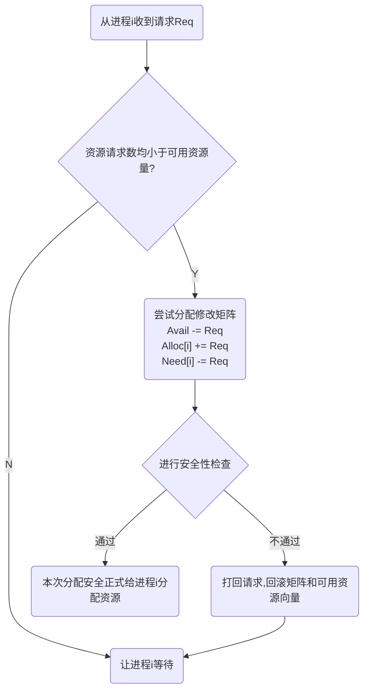

## 必要条件
- 互斥
- 不剥夺
- 请求和保持
- 循环等待

## 预防
- 破坏互斥把互斥资源变成共享资源 如spooling
- 破坏不剥夺条件
	- 当某个进程请求新的资源而得不到时，立刻释放其已有资源，以待后面再次申请
	- 为进程设置不同的优先级，当某个进程需要的资源被其他进程占用时，可以由操作系统协作将想要的资源强行剥夺。
	**缺点**
	- 实现起来较为复杂；
	- 这种方式会造成前一阶段工作的失效，因此仅适用于易保存和恢复的资源，例如CPU；
	- 反复申请和释放资源会造成较大的系统开销；
	- 若采用方案一，可能导致饥饿（某个进程一直被迫放弃已有的资源）。
- 破坏请求和保持条件
	采用**静态分配方法**，在运行前一次性申请所需的全部资源，在未获得全部资源前进程不投入运行。一旦投入运行，这些资源一直归此进程所有。
	**缺点**
	- 对于使用时间很短的资源会造成资源浪费，资源利用率低；
	- 有可能导致某些进程饥饿。
- 按照顺序或者偏序申请资源
	采用顺序资源分配法，首先给系统中的资源编号，规定每个进程必须按编号递增的顺序请求资源，同类资源（即编号相同的资源）一次申请完。
	**缺点**：
	- 不方便增加新的系统资源，有可能需要全部重新分配序号；
	- 进程实际使用资源的顺序可能与序号不一致，会造成资源浪费；
	- 必须依次申请资源，编程麻烦。
## 避免
安全序列 不安全序列  死锁
### 银行家算法
假定有m个进程, n种资源
最大需求矩阵$Max$
当前分配矩阵$Alloc$
当前需求矩阵$Need$
有$Max = Alloc + Need$
当前可用资源向量 $Avail$
请求向量$Req$


安全性算法
```
p := 进程集合
work := avail

while !p.empty() {
	i := p.find_and_remove((i)need[i]<work).throw("不安全")
	work += alloc[i]
}

return "本次分配安全"

```
## 检测和解除
资源分配图
化简资源分配图
```
p := 进程集合
while !p.empty() {
	_ := p.find_and_remove((i)i对应的资源系统还有,即不堵塞).throw("会死锁")
}

return "安全"
```
在化简资源分配图后，还有边连接的进程就是死锁进程。对于死锁的进程，需要解除死锁。
资源剥夺法：挂起某些死锁进程（暂存到外存上），抢占其资源并分配给其他死锁的进程。需要注意防止被挂起进程产生饥饿；
撤销进程法（终止进程法）：强制撤销部分甚至全部死锁进程并释放其资源。优点是实现简单，缺点是会导致进程之前的努力全部木大；
进程回退法：让一个或多个进程回退到可以避免死锁的地步。需要系统记录进程的历史信息并设置还原点。

## 哲学家进餐
1. 至多4名哲学家拿起餐具
2. 偶数号的哲学家和奇数号码的哲学家拿餐具的顺序相反
3. 最后一位哲学家和其他哲学家拿餐具的顺序相反
4. 一次取两根筷子
