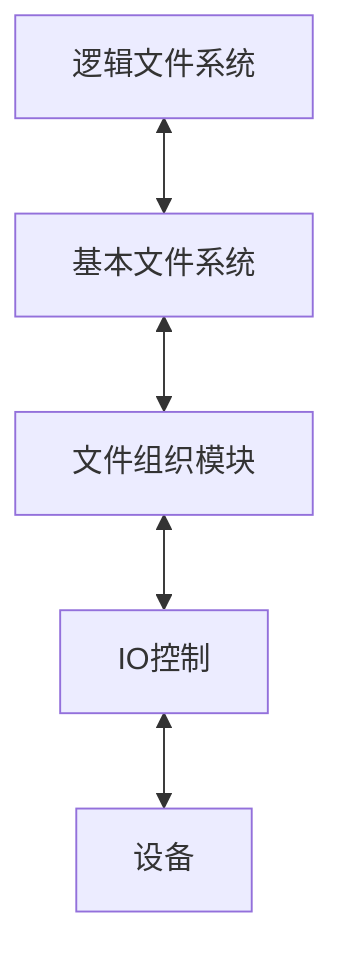
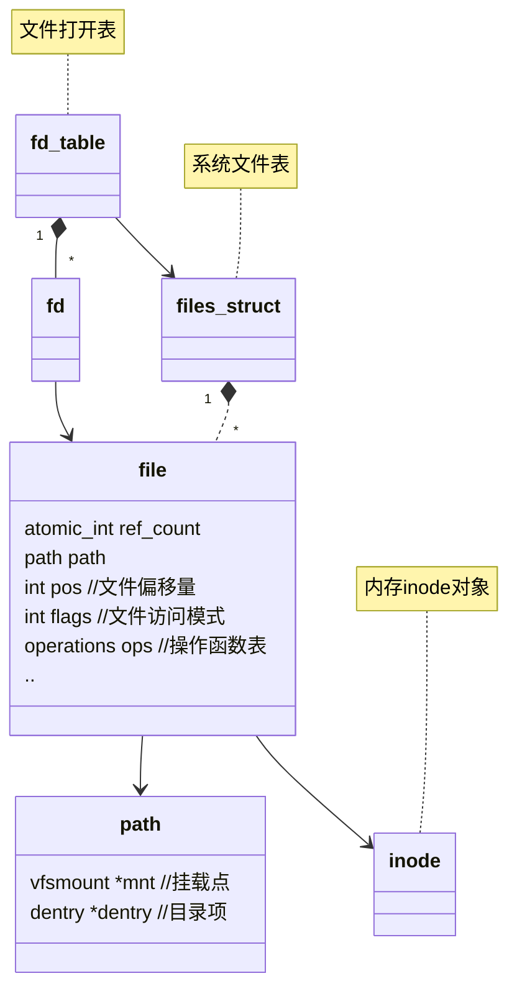

## 为什么需要文件系统
新鲜水果（内存中的数据）具有易失性，就像水果一样，如果不及时保存和处理，它们会很快腐烂或失去原有的新鲜度和营养价值。同样，内存中的数据在电源关闭或系统重启后就会丢失，无法再次访问或利用。

而果干（文件系统中的文件）是经过加工处理的水果，可以长期储存并保持其大部分的营养价值。即使时间过去很久，只要妥善保存，果干仍然可以食用，并提供所需的营养。文件系统持久化就像将新鲜水果制作成果干的过程，它确保数据即使在电源关闭或系统重启后也能保持不变，并且可以随时访问和利用。

因此，文件系统持久化的重要性在于它提供了一种机制，使得数据可以长期保存并随时可用，就像果干一样。这对于需要长期存储和处理大量数据的应用程序和系统来说至关重要，因为它们需要确保数据的安全性和可靠性，以便在需要时能够进行访问和分析
## 文件
### 定义
上层软件的抽象：一组有意义的记录的集合
操作系统对文件的抽象：视为字节序列

### 元信息
创建访问修改时间
类型
权限控制
所属用户用户组
...
### 分类
### FCB和索引节点
不采用索引节点之前所有文件的信息存放在目录项，目录内容比较庞大，查找文件的io次数多，采用索引节点后，把文件信息存放在索引节点中，目录项只用存放文件名和索引节点号，大大降低了io次数。**使用索引节点方法计算io次数时不要忘了加上访问索引节点的一次io**
#### 内存索引节点对象
是索引节点在内存中的缓存和副本，除了索引节点中的内容外还有索引节点号、状态（指示是否被修改过或者是否上锁）、引用计数、逻辑设备号、链接指针等字段
### 接口
create
delete
read
write
open
close
...
### 系统文件表 文件打开表
[[#关系图|系统文件表 文件打开表]] 

### 文件保护
#### 权限类型
#### ACL
#### 精简的访问控制列表
rwxrwxrwx
#### 加密和口令
### 文件共享
- 硬链接
- 软链接
### 上层抽象（逻辑结构）
- 无结构文件
- 结构化文件
	由一组相似的记录组成，又称**记录式文件**。每条记录又若干个数据项组成
	根据每条记录的长度是否相等，可以分为**定长记录**和**可变长记录**两种
	- 顺序文件
		- [[../数据结构与算法/查找#顺序查找|顺序查找]]
		- 串结构 按插入事件排列
		- 顺序结构 **定长记录时可以折半查找**
	- 索引文件 [[../数据结构与算法/查找#索引查找|索引查找]]
	- 索引顺序文件 [[../数据结构与算法/查找#索引顺序查找|索引顺序查找]] 最佳查找次数为$\sqrt N +1$
### 下层实现（物理结构）
#### 连续结构
#### 链接结构
- 隐式链接
- 显式链接（FATfs）文件系统中存放一张FAT表, 在文件系统初始化时载入内存，每一个表项的内容是指向下一个盘块的指针，可以用一个特殊的数字$-1$来表示没有下一项，**计算文件的最大大小要注意这个无效状态**，减去一个多余的块大小。**另外FAT表还能把空闲盘块链接起来，来实现空闲盘块管理**
#### 索引结构
- 单级索引
- 多级索引
- 混合索引
- unix方式 **共13个指针：一组数据块指针共10个，一级索引块指针、二级索引块指针、三级索引块指针各1个**

#### 比较
评价指标 动态性能（扩容缩容）开销 稳定性 随机和顺序访问性能 其他

|      | 访问第n个逻辑块（从1开始）的io次数                                 | 动态性能（扩容） | 开销                 | 随机访问                    | 顺序访问          | 其他                      |
| ---- | --------------------------------------------------- | -------- | ------------------ | ----------------------- | ------------- | ----------------------- |
| 连续存储 | 1（目录项已被读入内存）                                        | 差        | 最小                 | 最好                      | 最好            |                         |
| 隐式链接 | n（目录项已被读入内存）                                        | 好        | 每一个数据块都需要存放一个指针    | 最差                      | 一般            | 文件数据块的任一个指针出问题会导致文件数据丢失 |
| 显式链接 | 1（FAT表已被读入内存，**只用遍历内存中的FAT表**）                      | 好        | 文件系统中需要开辟一块区域做FAT表 | 较差（不用多次io，但要遍历内存中的FAT表） | 一般            |                         |
| 索引方法 | 数据块被$M$级索引块管辖就用$M+1$次，索引节点直辖的数据块仅用一次（inode节点已被读入内存） | 好        | 需要额外的索引块，维护索引结构    | 好，但是要访问额外的数据块           | 好，但是要访问额外的数据块 |                         |

## 目录
### 目录结构
- 单级结构
- 两极结构
- 树形
- 有向无环图
### 操作
- find
- createFile、createDir
- deleteFile、deleteDir
- move
- ls
- ...
### 实现
- 线性表
- 哈希

## 文件系统

1、逻辑文件系统  
⽤于管理元数据信息（包括⽂件系统的所有结构，不包括⽂件内容）  
管理⽬录结构  
通过FCB维护⽂件结构  
负责⽂件保护

2、基本文件系统  
组织⽂件及其逻辑块和物理块  
可以将逻辑地址转换为物理地址  
有空闲空间管理器，以跟踪未分配的块，根据需要提供给⽂件组织模块

3、文件组织模块  
向对应的设备驱动程序发送通⽤命令，以读取和写⼊磁盘的物理块  
管理内存缓冲区，保存各种⽂件系统，⽬录和数据块的缓冲

4、I/O控制  
设备驱动程序: 将输⼊的命令翻译成底层硬件的特定指令  
中断处理程序: 利⽤指令使IO设备与系统交互
### 文件系统布局
- MBR与分区表
- 引导块
- 超级快
- 空闲盘块管理区
- inode盘区
- 数据区（根目录与文件和目录区）
### 虚拟文件系统对象
- 超级块 `super_block` 表示一个特定的文件系统
- 索引节点对象 `inode` 特定的文件
- 目录项 `dentry` 特定的目录项
- 文件对象 `file` 表示已打开的文件
#### 关系图

- 使用`dup`调用后多出一个文件打开表项，新的表项仍然引用同一个`file`对象，所以还是共享`file`对象中的信息如读写偏移或者文件访问模式等等
- 使用`fork`调用后会克隆文件打开表，新的文件打开表中的每一项还是引用相同的`file`对象所以还是会出现竞争问题
### 空闲空间管理
- 空闲表
- 空闲链表
- 位向量
- 成组链接法
- [[#链接结构|FAT]]