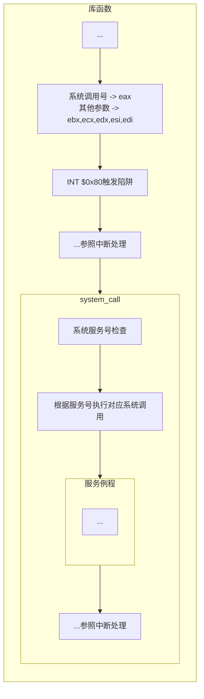

## 概念
虚拟机 联系底层硬件和上层软件的抽象层，屏蔽底层资源差异,  并暴路出一组接口供上层软件调用。

## 特征
并发并行 共享 虚拟 异步

## 目标与功能
管理（进程、线程调度，虚拟内存系统，硬件设备，文件管理）
接口（系统调用，命令行接口，图形接口）
扩充机器
封装

## 发展
手工操作阶段
批处理阶段
	单道批处理
	多道批处理
分时系统
实时系统
分布式
## CPU运行状态
内核态用户态
## 中断
作用 让内核强行夺取CPU控制权, 时CPU从用户态进入内核态
区分 中断、异常、陷阱、硬中断、软中断、内中断、外中断 
### 系统调用过程
- [[../计算机组成原理/cpu/中断#（典型的外部）中断处理流程|中断处理流程]]
- 系统调用处理过程

## 操作系统结构
- 模块化
- 分层法
- 宏内核
- 微内核
- 混合结构
- 外核
## 操作系统引导 
[[其他/linux启动过程|操作系统引导]]
## 虚拟机
### 概念
- host
- guest
- hypervisor
### 分类
- 一类虚拟机（裸金属架构），hypervisor运行于裸机之上
- 二类虚拟机（寄居架构），hypervisor作为guest寄生在host操作系统之上