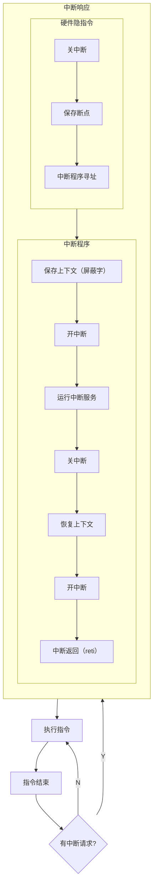

## （X86指令集的）分类

| 类型  |     | 异步同步 |                | 断点              |
| --- | --- | ---- | -------------- | --------------- |
| 中断  |     | 异步   | 外部设备发送的中断请求    | 下一条指令           |
| 异常  | 故障  | 同步   | 除0故障，页故障       | **重新执行发生故障的指令** |
| 异常  | 陷阱  | 同步   | 系统调用，单步追踪，断点调试 | 下一条指令           |
| 异常  | 终止  | 同步   | 硬件故障           | 程序终止            |
## 中断向量
操作系统注册的一张中断处理程序的程序入口表，发生中断时，硬件自动分发到对应的处理程序。不使用中断向量时则使用软件手动分发到具体的处理函数
## 中断屏蔽
（外部）中断分为可屏蔽中断与不可屏蔽中断，通过**控制总线**的**INTR线**发出的中断可以被**中断屏蔽字寄存器**与**中断使能寄存器**屏蔽（仅当中断被使能且该中断没有被屏蔽字寄存器屏蔽才会响应请求），通过控制总线的**NMI**线发出的中断请求是不可被屏蔽的。
## 中断判优
有多个中断请求时，优先处理那个中断请求，决定了中断的**响应优先级**
从上到下优先级依次降低
- [[../io/io#DMA请求|DMA申请访问内存请求]] 不是中断，**但是优先级高于一切中断**
- 不可屏蔽的外部中断
- 内部异常
	- 故障
	- 陷阱
- 可屏蔽中断
	- dma中断请求
	- io传送类的请求
		- 高速 > 低速
		- 输入 > 输出
		- 实时 > 普通
## 中断嵌套
允许在中断处理程序中响应新的中断
### 中断处理优先级
允许每一个中断源有自己的屏蔽字，当执行对应的中断处理程序时把屏蔽字设置为自己的屏蔽字，对于处理优先级比自己高的不屏蔽，优先级比自己低（**对本中断源也一般是屏蔽的**）的屏蔽（**一般1表示屏蔽、0表示允许中断**）。那么优先级高的就会抢占优先级低的执行权，在处理完毕后才把执行权返回给低优先级中断。就能灵活地调整中断处理程序的**处理**优先级。
## （典型的外部）中断处理流程

- cpu在每一条指令的**结束后**检查是否有无不被屏蔽的中断请求（不可屏蔽或者是可屏蔽但是允许中断）
- 如果有多个可响应的中断则根据中断判优顺序按顺序处理
- 中断隐指令 **硬件**实现，不需要在程序中显式给出，逻辑上表现的像一条指令一样
	- 中断触发器对应位置0
	- 关中断 置中断使能寄存器为0
	- 保存断点 把返回后要执行的指令的地址（如果是内部故障则是**当前**发生故障的指令的地址从而重新执行）压入堆栈或者是保存到一个寄存器中
	- 中断寻址 根据中断向量表跳转到对应中断处理函数的入口地址，或者在软件查询中跳转到总的处理程序入口地址，处理程序再根据中断类型号分发到具体的处理函数
- 中断程序
	- 准备阶段
		- 保存上下文和中断屏蔽字
		- 打开中断使能寄存器从而支持中断嵌套
	- 正式执行处理程序
	- 收尾
		- 关中断
		- 恢复上下文
		- 开中断
		- 返回 可以用reti指令同时完成开中断与返回
- 类比[[../../编译汇编链接二进制/高级语言的机器码表示#函数调用约定|普通的函数调用]]
## 其他
### 中断相关寄存器
- 中断使能寄存器
- 中断屏蔽字
- 中断请求标志寄存器 中断源对应位为1表示该中断源发起中断请求
### 总线
- 中断请求与响应是在控制总线上传递的
- 中断类型号在数据总线上传递的
### 系统调用
[[../../操作系统/操作系统概述#系统调用过程|系统调用过程]]
