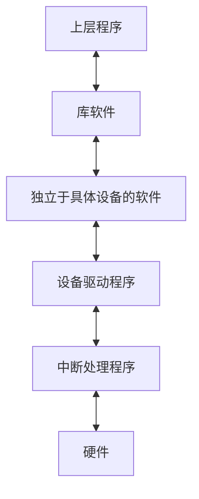
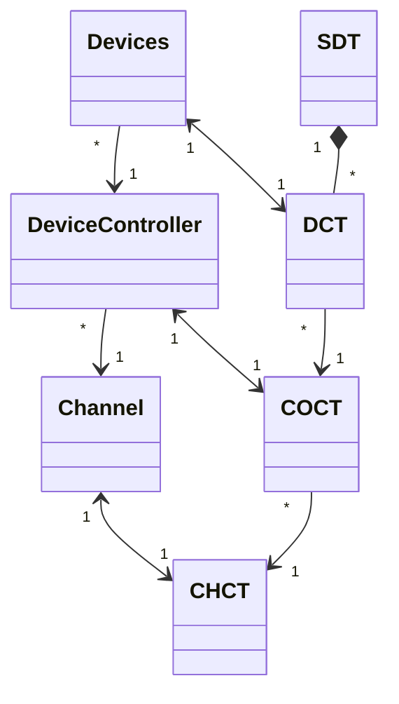

I/O设备就是可以将数据输入或者可以接收计算机输出数据的外部设备，属于计算机中的硬件部件。
## 分类
按照**使用特征**，I/O设备可以分为以下几类：
- 人机交互设备
- 存储设备
- 网络通信设备

按照**传输速度**，I/O设备可以分为以下几类：
- 低速设备：键盘鼠标等
- 中速设备：打印机等
- 高速设备：硬盘等

按照**信息交互的单位**，I/O设备可以分为以下几类：
- 块设备
    - 以数据块为单位进行信息交互
    - 读取速度快
    - 可寻址（可以随机的读写任意一块）
- 字符设备
    - 传输的基本单位是字符
    - 读取速度慢
    - 不可寻址
    - 输入输出采用中断驱动方式
按照**共享属性**分类
- 独占设备 
- 共享设备 同一时间**段**内允许多个进程访问的设备 一般是可寻址和随机访问的设备
- 虚拟设备 spooling技术把一个物理设备虚拟化成多个逻辑设备
## IO设备抽象模型

- 设备控制器 == io接口,**磁盘io接口== 磁盘控制器 != 磁盘驱动器**
- 数据总线 传输数据，**也可以指令代码或状态信息**，有时甚至是一个控制信息
- 地址线 选中设备
- 控制线 传输控制信号和时序信号。控制信号中，有的是微处理器送往存储器和I／O接口电路的，如读／写信号，片选信号、中断响应信号等；也有是其它部件反馈给CPU的，比如：中断申请信号、复位信号、总线请求信号、限备就绪信号等
- io逻辑
	- 接收和识别CPU发来的各种指令 
	- 对设备发出指令
- 控制器与设备的接口
	- 用于实现控制器与设备之间的通道
	- 数据线传输数据
	- 状态线向控制器反馈当前设备状态
	- 控制器通过控制线向相应的设备发送控制信号 
### 编址方式
- 独立编址
- 与内存编址在同一个地址**mmio**
## IO控制方式
- 轮询
	- 独占轮询 忙等
	- 定时查询 每一个while循环的结束或者是每隔一段时间去查询io结果
- [[../cpu/中断|中断]]
- dma
- 通道 一个协处理器，能够执行IO相关的程序
	- 字节多路通道
	- 选择通道
	- 数组多路通道
## DMA
### DMA控制器
抽象模型
### 过程
- 预处理 CPU向DMA控制器提交IO任务发起DMA请求，初始化相关寄存器设置传送方式
- 数据传送 
	- 一次DMA传送完成一个数据块的读写，DMA传送由若干轮循环组成。一次循环完成一个总线宽度的读写。
	- 循环由内部的计数器寄存器与地址寄存器控制。每一轮循环对地址寄存器指向的地址发起读写，循环结束后计数器减1地址寄存器加1，当计数器减为0结束循环
	- 每一轮循环输出时对地址寄存器指向的地址发起读请求，把结果写到内部的暂存器，等待到输出设备处理完暂存器的数据进入下一轮循环
	- 每一轮循环输入时等待输入设备准备好一个暂存器大小的数据，然后对地址寄存器指向的地址发起写请求，访存结束后进入下一轮循环
	- 控制器与设备的数据交互的单位可能不足一个存储字通常是是字节或者是位，一次循环内要反复对设备进行读写
- 后处理 对CPU发起中断汇报任务结果
#### DMA请求
下面四种说法会混着用，但一般指的是第三个
- 预处理阶段cpu向dma接口提交的IO任务
- 数据传送阶段设备向dma接口发送的读写请求
- 数据传送阶段向CPU申请总线从而对内存发起读写的传送请求
- 后处理阶段dma控制器在IO任务执行完毕或者是出现错误时向CPU发起汇报的中断请求
#### DMA传送方式 
在数据传送阶段CPU与DMA控制器争用主存的处理策略
- 停止CPU访存
- DMA与CPU交替访存 固定的将时钟周期分为两份，一份CPU使用、一份DMA使用
- 周期挪用 CPU与DMA同时申请访存，dma访存优先。CPU在每一个**机器周期**的末尾检测是否有DMA传送请求，如果有将允许DMA接口窃取**存取周期**
## IO软件

- 用户层软件
    - 提供了与用户交互的接口，用户可以直接使用该层提供的**库函数**对I/O设备进行操作
    - 将用户的请求进行翻译，通过**系统调用**请求操作系统内核的服务
- 设备独立性软件（设备无关软件）
    - 向上层提供调用接口
    - 对设备的保护，与对文件的保护类似
    - 差错处理
    - 设备的分配与回收
    - 数据缓冲区管理
    - 建立逻辑设备名与物理设备名之间的映射关系，并选择调用相应的驱动程序
        - 通过**逻辑设备表（LUT）** 实现
        - 可以整个系统一张LUT，也可以每个用户一张LUT（类似两级目录）
- 设备驱动程序
    - 将抽象要求转化为具体要求
    - 检查I/O请求的合法性
    - 了解I/O设备状态、传递相关参数、设置设备工作方式
    - 发出I/O操作命令，启动I/O设备
    - 响应通道的中断请求
    - 构造通道程序
- 中断处理程序
    - 当I/O任务完成时，I/O控制器会发出**中断信号**，系统会根据此信号找到相应的**中断处理程序**并执行

#### 设备独立性软件
#### 磁盘缓存
#### 缓冲区
##### 分析
带缓冲区的io过程大致可分为三个环节：
- 设备数据输入缓冲区 $T$
- 缓冲区设备传输到工作区$M$
- 工作进程处理数据$C$
另外带缓冲区的题目亦可能涉及到[[../../考研408/流水线与空间时间并行技术|流水线与空间时间并行技术]]工作的题目
##### 单缓冲
此时$T$和$C$是可以并行的，$M$和$T$或$C$之间只能串行工作那么每块数据的处理时间为$Max(T,C)+M$
单缓冲只能实现**半双工**的交换数据，数据是**能双向交换的**，**但是一个时间内只能向一个方向交换**
##### 双缓冲
此时T与M或C之间是能并行的，MC串行，故处理时间为$Max(M+C,T)$
**双缓冲能全双工交换数据**
##### 环形缓冲
##### 缓冲池
- 收容输入 hin
- 提取输入 sin
- 收容输出 hout
- 提取输出 sout

#### 设备的分配与回收
##### 设备分配时应考虑的因素
- 固有属性 独占、共享、虚拟
- 分配策略
	- FCFS
	- SJF
	- 优先级
	- ...
- [[../../操作系统/并发/死锁|安全性]]
	- 安全分配方式：为进程分配一个设备后就将进程阻塞，本次I/O完成后才将进程唤醒
	    - 优点：破坏了**请求和保持**条件，不会造成死锁
	    - 缺点：对于一个进程来说，CPU和I/O只能串行工作
	- 不安全分配方式：进程发出I/O请求后，系统为其分配I/O设备，进程可继续执行，之后还可以发出新I/O请求。**只有某个请求得不到满足时才将进程阻塞**。
	    - 优点：效率高，进程和I/O任务可以并行的执行
	    - 缺点：有可能发生死锁
##### 分配方式
- 静态分配：进程运行前为其分配全部所需资源，运行结束后归还资源
    - 破坏了“**请求和保持**”条件，不会发生死锁
- 动态分配：进程运行过程中动态申请设备资源
##### 设备分配管理中的数据结构

- **设备控制表（DCT）**：每个设备一张，用于记录设备情况
    - 设备类型
    - 设备标识符
    - 设备状态
    - 指向控制器表的指针：指明设备所属的控制器
    - 重复执行次数或时间：只有多少次I/O操作失败后才判断失败
    - 设备队列的队首指针：指向当前设备的等待进程队列（由PCB组成）
- **控制器控制表（COCT）**：每个控制器一张，操作系统跟具COCT对控制器进行操作和管理
    - 控制器标识符
    - 控制器状态
    - 指向通道表的指针：指明控制器所属的通道
    - 控制器队列的队首指针：指向正在等待控制器的进程队列
    - 控制器队列的队尾指针
- **通道控制表（CHCT）**：每个通道一张，操作系统根据CHCT对通道进行操作和管理
    - 通道标识符
    - 通道状态
    - 与通道连接的控制器表首址：可通过该指针找到该通道管理的所有控制器相关信息
    - 通道队列的队首指针
    - 通道队列的队尾指针
- 系统设备表（SDT）：记录了系统中全部设备的情况，每个设备对应一个表目
    - 每一个表目记录设备的相关信息
        - 设备类型
        - 设备标识符
        - DCT（设备控制表）
        - 驱动程序入口
##### 分配步骤
1. 根据进程请求的**物理设备名**查找SDT
2. 根据SDT找到DCT
    - 若设备忙碌则将进程PCB挂到设备等待队列中
    - 不忙碌则将设备分配给进程
3. 根据DCT找到COCT
    - 若控制器忙碌则将进程PCB挂到控制器等待队列中
    - 不忙碌则将控制器分配给进程
4. 根据COCT找到CHCT
    - 若通道忙碌则将进程PCB挂到通道等待队列中
    - 不忙碌则将通道分配给进 程。
###### 缺点
用户必须使用物理设备名来请求设备，这导致了
- 若换了一个物理设备，则程序无法运行
- 若进程请求的物理设备正在忙碌，则即使系统中还有同类型的设备，进程也必须阻塞等待这特定的一个
###### 解决方式
建立**逻辑设备名**与物理设备名的映射表。
用户在请求设备时只需要提供逻辑设备名（即设备类型），系统会查找符合条件且空闲的设备分配给进程。

##### 逻辑名到物理名映射
- 设备逻辑表logical unit table，每一项含3项内容， **逻辑设备名物理设备名和驱动程序的入口地址**
- 设置逻辑设备表的两种方式 [[../../操作系统/持久化#目录结构|对比目录结构]]
	- 整个系统一张lut
	- 一个用户一张lut
#### SPOOLing

利用磁带实现的脱机技术：在输入输出时，使用专门的输入输出设备从磁带中读/写信息。之后再由CPU高速的从磁带中读/写数据。
**假脱机技术**：又称**SPOOLing技术**，用软件的方式模拟脱机技术。SPOOLing系统的组成如下
在磁盘上专门开辟出两个存储区域：**输入井**和**输出井**。
- 输入井
    - 模拟脱机输入时的磁带
    - 用于收容I/O设备输入的数据
- 输出井
    - 模拟脱机输出时的磁带
    - 用于收容用户进程输出的数据
- 输入缓冲区
    - 在输入进程的控制下，用于暂存从输入设备输入的信息
    - 之后再转入到输入井中
- 输出缓冲区
    - 在输出进程的控制下，用于暂存从输出井传来的数据
    - 之后再传入输出设备上
Spooling系统的管理
- **预输入程序**：管理输入缓冲区
- **井管理程序**：管理输入输出井
- **缓输出程序**：管理输出缓冲区
### 用户驱动程序
## 五类IO模型
- 同步阻塞
- 同步非阻塞
- 异步
- 信号驱动
- 多路复用