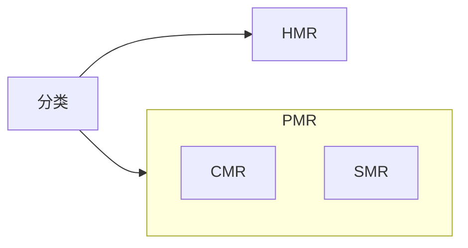

## 结构
磁盘 磁头 电机 磁头控制器 **磁盘控制器（io接口）** 缓存...
## 概念
柱面 磁道 扇区
扇区：硬盘最小得读写单元
块/簇：多个扇区组合在一起为一个块，一般是$2^n$个扇区，是操作系统对硬盘读写最小单元
页：硬盘与内存之间操作的最小单元
## 分区
- MBR
- GPT
<https://wiki.archlinux.org/title/Partitioning>
## 格式化
- 低级格式化（物理格式化）
	检测硬盘磁介质，划分磁道，为每个磁道划分扇区
- 分区
- 高级格式化（逻辑格式化）
	建立文件系统
## 机械硬盘(顺序读写负载)存取时间
- $寻道时间 = 磁道数量*经过每个磁道所要的时间 + 启停时间$
- 旋转时间 $平均旋转时间 = 旋转半圈的时间$
- 传输时间
## 寻址方式
- CHS寻址 Cylinder(柱面)、Heads(磁头)、Sector(扇区) 柱面是径向的 磁头决定了是哪个盘片扇区决定了是在磁道的哪个位置 **S从1开始编号**
- LBA寻址 $LBA = (C*磁头数 + H)*扇区数  +(S-1)$
- 考虑到**ZBR(Zone Block Record)，采用等密度结构**，LBA的寻址此时是由硬盘控制器来实现的.
## 记录数据的方式

## raid
- 指标 可靠 容量 吞吐量（不同类型的工作负载 顺序/随机 读/写）
- raid0 [[../../考研408/流水线与空间时间并行技术|流水线与空间时间并行技术]]
- raid1
- raid4
- raid5
- 软raid
- 硬raid
## lvm
<https://wiki.archlinuxcn.org/wiki/LVM>
## 常见指标
连续读写速度
随机读写速度
4k文件多线程读写速度
容量
转速 rpm
...
## 磁盘调度算法

|                                | 公平  | 效率  |                                              |
| ------------------------------ | --- | --- | -------------------------------------------- |
| FCFS                           | O   | X   | 对于一个磁道跨度大的工作负载表现差                            |
| SSTF（shortest seek time first） | X   | O   | 对较远磁道的作业不公平                                  |
| SCAN（电梯调度）                     | O   | O   | 到达最边上的磁道才反向移动, 对刚扫描过的磁道不公平访问局部性不好，偏向于边上磁道的请求 |
| CSCAN                          | O   | O   | 单项移动提供服务解决了偏向于边上磁道的请求的问题                     |
| LOOK                           | O   | O   | 跟SCAN相比不用移动到最边上，缩短寻道时间                       |
| CLOOK                          | O   | O   | 跟CSCAN相比不用移动到最边上，缩短寻道时间                      |

## 关联
- [[../../软件/linux下硬盘管理和文件系统|linux下硬盘管理和文件系统]]