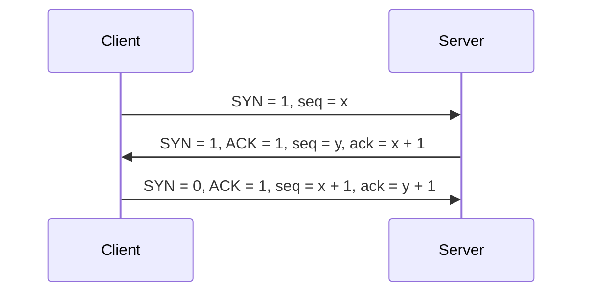

## Transport Control Protocol
## 特点
- TCP是**面向连接**（虚连接 对比[[../体系结构/概述#交换技术|电路交换]]与[[../网络层/概述#虚电路|虚电路]]）的传输层协议
    - 只有建立了连接才能开始通信
    - 连接是逻辑连接，不是实际链路
- 每一条TCP连接**只能有两个端点**，每一条TCP连接只能是**点对点**的
    - 无法用于**广播**等
- TCP提供**可靠交付**的服务，无差错、不丢失、不重复、按序到达
- TCP提供**全双工通信**
    - 发送缓存
        - 准备发送的数据
        - 已发送但尚未收到确认的数据
    - 接收缓存
        - 按序到达但尚未被接受应用程序读取的数据
        - 不按序到达的数据
- TCP**字节流交付给上层**（对比UDP按报文交付给应用层）
    - TCP把应用程序交下来的数据看成仅仅是一连串的无结构的字节流
    - TCP将要传输的数据分成多个字节，以字节为单位传送
## 首部格式

- 源端口 目标端口
- 序号 此报文段中所发送数据的**第一个字节**的序号
	- 在一个TCP连接中传送的字节流中的**每一个字节**都按顺序编号，而[[../可靠传输机制|可靠传输机制]]中所介绍的是每一个报文一个编号
- 确认号ack（32位，4B）：期望收到对方**下一个报文段**的**第一个数据字节**的序号
	- 区别于[[../可靠传输机制|可靠传输机制]]中的ack是确认已经收到的报文编号
	- ack是**捎带**的
- 数据偏移（4bit）：**以4B为单位**，数据部分从哪个偏移处开始，即首部长度
- 控制位
	- 紧急位URG：为1时，表示该报文中有紧急数据紧急指针有效，需要优先从TCP缓存队列中发送
	- 确认位ACK：为1时，**确认号才有效**
	- 推送位PSH：为1时，接收方尽快将消息交付到上层，不再等待缓冲区填满后才交付，如交互式网络应用
	- 复位RST：为1时，表示必须释放连接，然后再**重新建立传输链接**
	- 同步位SYN：为1时，表示这个报文是一个**建立连接**的请求/接收报文
	- 终止位FIN：为1时，表示此报文段发送方数据已发完，要求**释放连接**
- 窗口（16位，2B）：单位为字节（B），表示己方的接收窗口大小，即允许对方发送的数据量（0∼216−10∼216−1）
- 检验和 [[../校验和|校验和]]
- 紧急指针（16位，2B）：URG=1时才有意义，表明本报文中紧急数据的字节数
    - 紧急数据从0开始
    - 实际上指向的是紧急数据尾部的位置
- 选项（长度可变）：最大报文段长度MSS、窗口扩大、时间戳、选择确认
- 填充：使TCP首部长度为4B的整数倍
## TCP分段（片）
- [[../网络层/ipv4#分片|MTU(Maximum Transfer Unit)]]：一个**网络包**的最大长度，以太网中一般为1500字节
- MSS(Maximum Segment Size)：最大分段大小，**除去 IP 和 TCP 头部之后，一个网络包**所能容纳的 TCP 数据的最大长度，一个典型的大小是1500 - 20 - 20 = 1460字节或者是536B
- [既然 IP 层会分片，为什么 TCP 层还需要 MSS 呢？](https://xiaolincoding.com/network/3_tcp/tcp_interview.html#%E6%97%A2%E7%84%B6-ip-%E5%B1%82%E4%BC%9A%E5%88%86%E7%89%87-%E4%B8%BA%E4%BB%80%E4%B9%88-tcp-%E5%B1%82%E8%BF%98%E9%9C%80%E8%A6%81-mss-%E5%91%A2)
## 三次握手

- `x`，`y`都是随机生成的数字
- 前两次握手虽然没有携带任何数据但是都需要**消耗一个序号**，ack向前推进
- 第三次握手可以**捎带数据**
- server收到第一个连接后进入**半连接**状态 如果一直发送第一次握手的SYN数据包，并不进行确认，导致服务器有大量挂起等待确认的TCP连接，消耗CPU和内存，进而导致死机
- [为什么是三次握手？](https://xiaolincoding.com/network/3_tcp/tcp_interview.html#%E4%B8%BA%E4%BB%80%E4%B9%88%E6%98%AF%E4%B8%89%E6%AC%A1%E6%8F%A1%E6%89%8B-%E4%B8%8D%E6%98%AF%E4%B8%A4%E6%AC%A1%E3%80%81%E5%9B%9B%E6%AC%A1)
	- 能防止历史连接的建立
	- 能减少双方不必要的资源开销
	- 能帮助双方同步初始化序列号
	- 「两次握手」：无法防止历史连接的建立，会造成双方资源的浪费，也无法可靠的同步双方序列号；
	- 「四次握手」：三次握手就已经理论上最少可靠连接建立，所以不需要使用更多的通信次数。
## 四次挥手

- 客户端发送**连接释放报文段**，停止发送数据，主动关闭TCP连接，转为**FIN-WAIT-1**状态
- 服务器端回送一个确认报文段，并转为**CLOSE-WAIT**状态；**客户到服务器**这个方向的连接就释放了（半关闭状态），客户端收到这个确认段后转为**FIN-WAIT-2**状态
	- **对于客户端的fin报文要消耗掉一个ack**
- 服务器端发完数据，就发出**连接释放报文段**，主动关闭TCP连接，转为**LAST-ACK**状态
- 客户端回送一个确认报文段，转为**TIME-WAIT**状态，再**等到时间等待计时器设置的2MSL**（最长报文段寿命）后，连接彻底关闭
	- **对于服务器的fin报文要消耗掉一个ack**
- **fin报文要消耗掉一个ack**
- 2MSL的意义：防止服务器端因为未收到客户端的确认报文段导致无法关闭
	如果第四次挥手丢包了怎么办呢
- 客户机释放的最短时间是$RTT+2MSL$，服务器最短的释放时间是$1.5RTT$
## 保活机制
## TCP可靠传输
1. [[../可靠传输机制|可靠传输机制]]
2. 校验
	与UDP类似，通过伪首部进行检验和校验
3. 序号
	为传输流中的每一个字节进行编号，将缓冲区中的字节组成若干个TCP段（数据报），通过确认号和序号的机制进行发送
4. 确认
	接收方收到报文段后，返回确认字段，确认字段中的确认号为下一个期望收到的起始字节编号。采用捎带确认与累计确认
5. 重传
- 超时重传：TCP的发送方在规定的时间（重传时间RTTs）内没有收到确认就要重传已发送的报文段，RTTs是动态计算得到的
    重传时间过短：太长的数据报来不及发送完毕
    重传时间过长：增加网络空闲时间，降低传输效率
- 冗余ACK（冗余确认） 每当比期望序号大的失序报文段到达时，发送一个冗余ACK，指明下一个期待字节的序号
## 流量控制
TCP利用滑动窗口机制实现流量控制。
接收方根据自己的缓冲区大小，动态的通过窗口字段调整发送方发送窗口的大小。
发送方窗口大小取接收窗口rwnd和拥塞窗口cwnd的最小值
拥塞窗口：发送方根据自己估算的网络拥塞程度而设置的窗口值，反映网络当前容量
当接收方通过确认重传机制进行字节编号确认时，会连带着修改发送方的允许发送窗口大小
TCP为每一个连接设有一个**持续计时器**，只要TCP连接的一方收到对方的零窗口通知，就启动持续计时器。到时间则发送一个**零窗口**的**探测报文段**，并重置计时器时间。
## 拥塞控制
假设接收窗口非常大，那么我们就不用考虑接收方，而只去考虑对链路拥塞的影响
### 慢开始和拥塞避免

- cwnd的**单位是报文段**
- 默认的初始值为1（或**MSS**长度）
- 传输轮次：从发送一批报文段到收到它们的确认所用的时间，单位为往返时延RTT
- 慢开始：cwnd的增加速度为指数型增长，起始为1
	- 当某个RTT开始时的 $2cwnd \gt ssthresh$时，**不采用指数增长，下个RTT开始时的cwnd=sstresh**
- 拥塞避免：当cwnd的值达到慢开始门限**ssthresh**时，增长模式变为每次+1
- 网络发生拥塞
    - 将**cwnd置为1**，重新进入慢开始算法
    - 将ssthresh置为**当前cwnd的一半**，提前进入拥塞避免算法
### 快重传和快恢复

- 快重传：采用冗余ACK机制，当收到**3次连续的冗余ACK**时执行快重传，重新发送丢失帧
- 新的ssthresh为发生拥塞时cwnd的一半
- 快恢复：当发送拥塞时，只需要将窗口降低到新的**慢开始门限ssthresh**，再次进入拥塞避免算法即可

