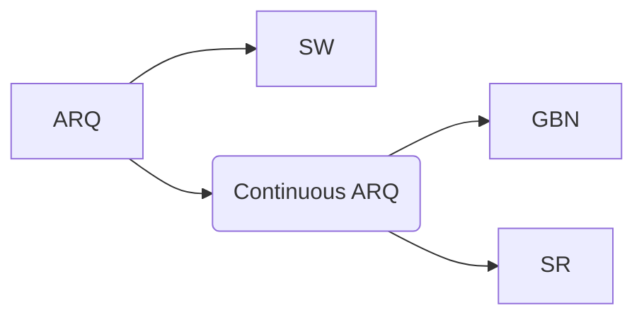

## 目的
把底层物理的不可靠信道改造成一个逻辑上的可靠信道
## 差错的种类
- 位错
- 帧错
	- 失序
	- 重复
	- 丢失
## RDT1.0
假设底部信道完全可靠
### 状态机

## RDT2.0
在RDT基础上考虑发送方到接收方的信道不可靠，可能出现位错，发送方在发送数据包时添加校验位等待接收方的回应，接收方在收到数据包后做校验，如果出现错则给发送方返回NAK提示对方重传，否则发送ACK告诉对方发送下一个数据包
### 新问题
发送方到接收方的信道不可靠
### rdt2.0 (在rdt1.0基础上)采用的新机制:
- 错误检测
- 接收者反馈: 控制信息(ACK,NAK)
- 重传
### 状态机

## RDT2.1
考虑到实际上接收方到发送方的信道也是不可靠的，那么实际上接收方给发送方的回应也可能出错，此时也要为回应添加校验位。当校验失败时发送方应该发送下一个数据包还是重传数据包？如果接收方原本回应的是ACK那么重传数据包会导致冗余的数据包，如果接收方原本回应的是NAK发送下一个数据包则会导致数据包失序。所以发送方还要额外给数据包添加一个序号，提示发送方该数据包的顺序，就能防止上面的问题。如果ACK/NAK受损，发送方重传当前的分组。接收方丢弃(不再向上交付)冗余分组
### 新问题
接收方到发送方的信道也是不可靠的
### 新机制
- 序号（在停等协议下只需1比特即可）
### 状态机

## RDT2.2
实际上rdt2.1存在等价状态，NAK等价于我ACK上一个数据包的序号，即告诉发送方我上个数据包顺利接收了，但是本次数据包有点问题请麻烦重传下，所以可以合并等价状态，简化状态机

## RDT3.0
底层信道还可能出现分组丢失的问题，如果我在发送后迟迟没有收到接收方的ACK则认为该数据包丢失，超时器触发时给接收方重传该数据包，如果这个分组是冗余分组接收方直接丢弃就是（在回应分组丢失的情况下），再发个ACK就好了。
### 新问题
- 丢包
### 解决方法
- 超时器
### 状态机

## ARQ协议（Automatic Repeat-reQuest）

### 停等协议(Stop-Wait)
到此RDT协议经过多次迭代似乎大功告成。但是实际上rdt3.0是个停等协议，信道利用率很低。
#### 信道利用率
**设发送方发送时延为$T_D$，接收方$T_A$，往返时延$RTT$则信道利用率为**
$$
\frac{T_D}{T_D+T_A+RTT}
$$
可以看出信道利用率低
### 流水线协议
[[../考研408/流水线与空间时间并行技术|流水线与空间时间并行技术]]
#### 信道利用率
**设发送方发送时延为$T_D$，接收方$T_A$，往返时延$RTT$则信道利用率为
$$
\begin{cases}
u&,\text{ u<1} \\
1&, \text{ otherwise}
\end{cases}
\text where \space u = \frac{n T_D}{T_D+T_A+RTT}
$$

### GBN机制
#### 接收方
- 对在途的pkt进行计时
- timeout(n): 
	重传 pkt n 和窗口中**所有顺序号高于n、已发送但未确认**的pkts
#### 发送方
- 接收方按序接收即**接收窗口为1**
- 使用**累计确认**原则：按顺序到达的、正确的 pkt给予确认
- 收到失序或者损坏的分组丢弃并**重新确认上次接收的正确、按顺序到达的、最高顺序号的数据报**
#### 状态机
- 发送方
	
- 接收方
	
- 示例
	
### 选择重传（Selective-Repeat）
#### 机制
- 接收者单独(individually)确认所有正确接收的数据报
	按需要缓冲所有数据报, 等所有数据到齐了以后交付给上一层
- 发送者仅重传**未接收**到 ACK的数据报
	给**每一个**未确认的数据报计时（GBN协议是为还未接收到回应的所有报文一起记个时）
- 发送窗口大小N
	限制了已发送，未确认数据报顺序号的范围 

#### 发送方
- 上层传来数据 :
	如果窗口中下一个序号可用, 发送报文段
- timeout(n):
	重传分组n, 重启其计时器
- ACK(n) 在发送窗口中:
	标记分组 n 已经收到
	如果n是**最小未收到应答的分组**，**向前滑动窗口**base指针到下一个未确认序号
#### 接收方
- 收到分组n
	- 在接收窗口内
		- 发送ACK(n)
		- 失序缓存按序交付
	- 在接收窗口之前（已经接收到过了）
		- ACK(n)
	- 在接收窗口之后或者损坏
		- 丢弃分组

### 窗口大小与序号宽度
记发送窗口为$W_S$,接收窗口为$W_R$，序号宽度为$n$则$$W_S+W_R \le 2^n$$
#### 否则
假如发送窗口为3，接收窗口为2，序号为2位
1. 发送方给接收方发送 0,1,2三个数据包
2. 接收方收到数据包给发送方发送ACK0~2，期待收到3, 4（4在模4下其实是0）
3. ACK丢失
4. 发送方触发超时重传 0,1,2
5. 接收方收到了0，1，2，把0号数据包错当4号数据包接收
6. 出错
#### 三种ARQ协议的发送窗口与接收窗口比较

| 协议  | $W_S$                                   | $W_R$               |
| --- | --------------------------------------- | ------------------- |
| SW  | $1$                                     | $1$                 |
| GBN | $1 \le W_S \lt 2^n$                     | 1                   |
| SR  | $1 \lt W_R \le 2^{n-1} \le W_S \lt 2^n$ | $W_S + W_R \le 2^n$ |
