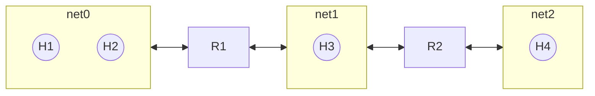

Address Resolve Protocol, 实现[[ipv4|三层地址]]到[[../链路层/mac地址|二层地址]]的转换
## 概念
ARP缓存 ARP表
## 分析

### H1给本地网络上的H2发消息
- H2的mac地址命中arp缓存，把mac地址写入以太网帧，向H2发送消息
- H2mac地址未命中arp缓存，通过目标mac地址为FF-FF-FF-FF-FF-FF，源地址为本机mac地址帧封装arp广播请求分组，H2收到这个分组后向H1单播发送响应分组，源地址为H2的mac地址，目标地址为H1的mac地址，H1收到响应后把mac地址写入arp缓存，然后按查询到的地址发送以太网帧
### H1给其他网络的主机发送消息
H1发现目的地址的网络前缀不是本地网络，此时H1使用arp协议找到默认网关的mac地址（默认网关的ip地址是[[dhcp]]协议或者自己手动配置的），剩下的工作由默认网关完成
### 路由器给主机发消息
- 目的ip地址位于相连接的网络上 跟第一个情况相同
- 否则 如R1给H4发送消息，R1根据转发表找到输出端口和下一跳路由器的ip地址，使用arp协议找到R2的mac地址，然后把消息转发给R2进行处理